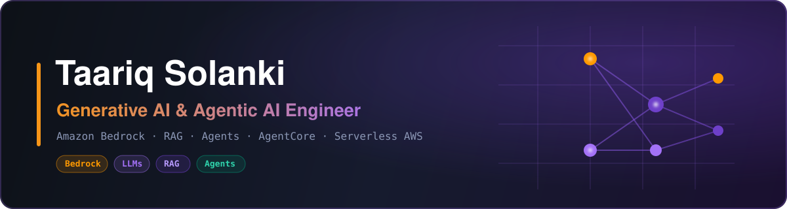

<p align="center">
  
</p>

<h3 align="center">👋 Hi, I'm Taariq — I build intelligent systems on Amazon Bedrock</h3>

<p align="center">
  From RAG pipelines and document AI to autonomous, multi-agent workflows that reason, retrieve, and act.
</p>

<p align="center">
  
  
  
</p>

<p align="center">
  <a href="https://www.linkedin.com/in/taariq-solanki-873909316/"></a>
</p>

---

### 🧠 About Me

```python
class TaariqSolanki:
    role        = "Generative AI & Agentic AI Engineer"
    core_cloud  = "Amazon Bedrock (on AWS)"
    skills      = ["LLMs", "RAG", "Prompt Engineering",
                   "Vector Search / Embeddings", "Fine-Tuning",
                   "Agentic Workflows", "AgentCore", "LLMOps",
                   "Guardrails & Evals"]
    builds_with = "serverless AWS — Lambda, S3, API Gateway, OpenSearch"
    exploring   = "autonomous agents that reason, retrieve & act"
    learning    = "agent orchestration · tool use · model routing"
    motto       = "Build AI that doesn't just answer — it acts."
```

🔹 **Generative AI** engineer specializing in **LLM application development** on AWS
🔹 Hands-on with **RAG**, **vector databases**, **embeddings**, **prompt engineering** & **model evaluation**
🔹 Designing **agentic AI** systems — tool use, function calling, and multi-step reasoning
🔹 Shipping everything as **serverless, Infrastructure-as-Code** on the AWS cloud

---

### ⭐ Core Platform — Amazon Bedrock

> Bedrock is my primary platform for shipping production-grade Generative AI on AWS.

- 🧩 **Knowledge Bases** — RAG over private data with managed embeddings & vector retrieval
- 🤖 **Bedrock Agents** — tool use, function calling & multi-step agentic workflows
- 🧠 **AgentCore** — deploying and operating AI agents at scale with secure runtime & memory
- 🔀 **Multi-model & cross-region invocation** — model routing across foundation models and AWS Regions
- 🛡️ **Guardrails & evaluation** — safe, grounded, and measurable model outputs
- 🖼️ **Multimodal GenAI** — text, vision, and image-generation workflows
- 🔌 **Provider-agnostic design** — the Converse API to swap foundation models with zero code change

---

### 🚀 Proof-of-Concept Projects

| Area | Project | Stack |
|------|---------|-------|
| 📄 Document AI | **Intelligent Document Processing** | Amazon Textract + Bedrock |
| 🔀 Resilience | **Cross-Region Model Invocation** | Bedrock inference profiles |
| 🗣️ Conversational AI | **Voice + Text Chatbot** | Lex · Lambda · Bedrock · Polly |

<sub>Hands-on POCs exploring production patterns on Amazon Bedrock.</sub>

---

### 🛠️ Tech Stack

**Generative & Agentic AI**


-4B32C3?style=for-the-badge&logo=databricks&logoColor=white)


**AWS AI/ML Services**


-005EB8?style=for-the-badge&logo=opensearch&logoColor=white)

**AWS Cloud Environment**


**Languages & DevOps**


---

### 📊 GitHub Stats

<p align="center">
  
  
</p>

<p align="center">
  
</p>

---

<p align="center"><i>⚡ Turning foundation models into agents that get real work done.</i></p>
